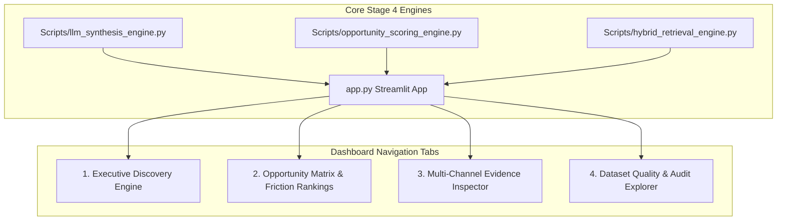

# Implementation Plan: Stage 5 — Interactive Discovery Engine Dashboard

This document details the architecture, component layout, aesthetic design, and verification strategy for implementing **Stage 5: Interactive Discovery Engine UI / Dashboard** in the Myntra Fashion Consumer Discovery Engine.

---

## 1. Confirmed Design & UI Principles

> [!IMPORTANT]
> **Key UI & Dashboard Objectives**:
> 1. **Executive Discovery Query Interface**: Allows product managers and strategists to ask natural language questions or pick from preset business questions (the 10 core questions).
> 2. **Grounded Section 12 Report Renderer**: Renders the 8-part executive report with visual badges, exact numerator/denominator metrics, and verbatim evidence quotes.
> 3. **Opportunity Matrix & Friction Explorer**: Interactive weighted opportunity matrix displaying rank, raw frequency %, severity multiplier, and opportunity scores.
> 4. **Multi-Channel Evidence Inspector**: Browse and filter representative quotes across Reddit, Play Store, App Store, and YouTube Comments with record IDs.
> 5. **Multi-Dataset Audit Tab**: Interactive view of all 12 dataset CSV files, text length distributions, and preserved intent counts.

---

## 2. Dashboard Architecture & Navigation

---

## 3. Proposed Component Breakdown

### A. Interactive Streamlit Discovery Dashboard
#### [NEW] [app.py](file:///c:/Users/palla/OneDrive/Desktop/Myntra%20Project/app.py)
- **Purpose**: Web UI providing interactive insight discovery, opportunity scoring, evidence inspection, and dataset auditing.
- **Key Features**:
  - **Header & Metrics Banner**: Displays total dataset count (5,706 records), hesitation sub-population count (1,202 records), and active channels (4 channels).
  - **Tab 1: Executive Discovery Engine**: Query input box + preset business question dropdown + 8-part Section 12 grounded report renderer.
  - **Tab 2: Opportunity Matrix**: Interactive bar charts and data tables ranking opportunities by frequency x severity.
  - **Tab 3: Evidence Inspector**: Multi-channel filter dropdowns (Reddit, Play Store, App Store, YouTube) displaying verbatim quotes with record IDs.
  - **Tab 4: Dataset Audit**: Complete overview of 12 CSV datasets and preserved `primary_intent` distribution.

---

### B. Documentation & Roadmap
#### [NEW] [docs/stage5_ui_spec.md](file:///c:/Users/palla/OneDrive/Desktop/Myntra%20Project/docs/stage5_ui_spec.md)
- Documents UI features, navigation structure, and execution command (`streamlit run app.py`).

#### [MODIFY] [docs/architecture.md](file:///c:/Users/palla/OneDrive/Desktop/Myntra%20Project/docs/architecture.md)
- Updates Stage 5 roadmap status to completed.

---

## 4. Verification Plan

### Automated & Runtime Verification
1. **Streamlit App Execution Test**:
   - Run `streamlit run app.py --server.headless=true` and verify that the server boots cleanly with 0 syntax or import errors.
2. **Data Integration Test**:
   - Verify that all tabs load data from `Processed Data/myntra_multidimensional_enriched.json` and `Processed Data/vector_index.json` without failing.
3. **Query Engine Verification**:
   - Test preset questions in Tab 1 and verify that grounded reports with exact numerators/denominators are generated instantly.

### Manual Verification
1. Launch the web app and inspect the UI layout, styling, cards, metrics, and evidence quotes across all 4 channels.
