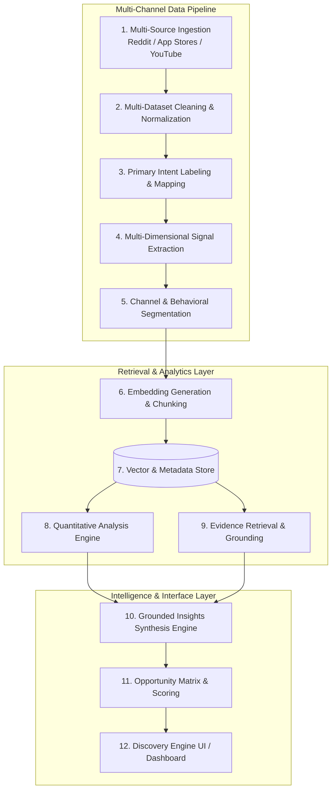
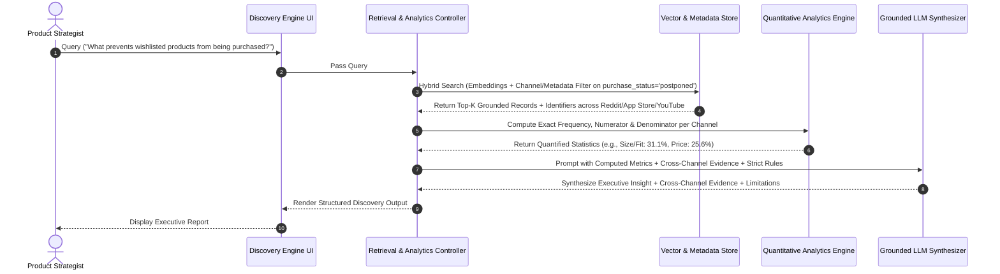
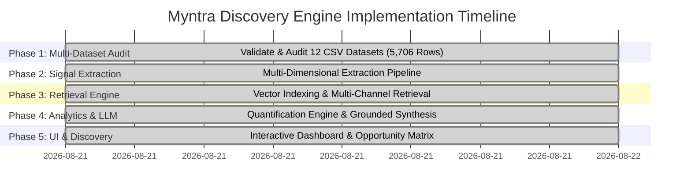

# Architecture Specification: AI-Powered Fashion Consumer Discovery Engine

> **Project Target:** Myntra Wishlist-to-Purchase Journey Analysis  
> **Core Objective:** Identify, quantify, compare, and surface high-leverage friction areas and opportunities preventing wishlisted products from converting into purchases across multi-channel consumer touchpoints (Reddit, Google Play Store, Apple App Store, and YouTube).

---

## 1. System Overview & Strategic Objective

The **Myntra Fashion Discovery & Behavioral Insight Engine** is a specialized, evidence-grounded analytics system designed to bridge the gap between product wishlisting and final purchase completion.

```
Wishlist  ───►  Consideration  ───►  Purchase
                 │
                 └──► Friction / Uncertainty (Opportunity Area)
```

### Core Business Metric
- **Primary Focus:** Wishlist-to-Purchase Conversion / Reducing Friction in the Purchase Journey.
- **Analytical Principle:**  
  $$\text{IDENTIFY} \longrightarrow \text{QUANTIFY} \longrightarrow \text{COMPARE} \longrightarrow \text{CONNECT TO BUSINESS METRIC}$$

---

## 2. Modular Architecture & Pipeline Design

To prevent monolithic scripts and ensure maintainability, the system is strictly divided into **12 decoupled modules**.



### Decoupled Module Descriptions

| Module # | Module Name | Responsibilities | Output Artifacts |
| :--- | :--- | :--- | :--- |
| **1** | **Multi-Source Data Ingestion** | Extract raw conversations & reviews across Reddit, Play Store, App Store, and YouTube. | `Raw Data/*.csv` (11 raw files) |
| **2** | **Data Cleaning & Normalization** | Multi-dataset deduplication, HTML/special char cleaning, noise filtering, schema unification. | Cleaned dataset files |
| **3** | **Primary Intent Classifier** | Categorize top-level post/review intent (`wishlist`, `price_drop`, `app_friction`, etc.). | `Processed Data/reddit_myntra_labeled.csv` & unified intents |
| **4** | **Behavioral Signal Extractor** | Extract multi-dimensional tags per record (barriers, needs, factors, status). | `Processed Data/behavioral_signals.json` |
| **5** | **Channel & User Segmenter** | Segment by platform channel (Reddit vs App Store vs YouTube) & user behaviors (e.g. price-sensitive, fit-hesitant). | Structured segment indices |
| **6** | **Embedding Generator** | Vectorize multi-channel text chunks and metadata schemas using semantic embeddings. | High-dimensional vector embeddings |
| **7** | **Vector Store & Index** | Store embeddings + channel metadata for hybrid semantic retrieval. | ChromaDB / Vector Store |
| **8** | **Quantitative Engine** | Calculate exact numerators, denominators, shares, and comparative distributions across channels. | Analytical matrices |
| **9** | **Evidence Retriever** | Retrieve top representative cross-channel conversation/review passages. | Filtered evidence snippets |
| **10** | **Insights Synthesis Engine** | Generate structured business insights adhering strictly to retrieved context. | Grounded response payload |
| **11** | **Opportunity Scorer** | Rank and score opportunity areas based on frequency and business conversion impact. | Scored opportunity matrix |
| **12** | **User Interface** | Interactive analytical discovery interface for product managers & strategists. | Streamlit / Web UI |

---

## 3. Data Sources & Dataset Audit Inventory

The project incorporates **14 dataset CSV files** spanning **4 major consumer touchpoint channels**: Community Discussions (Reddit), Android App Reviews (Google Play Store), iOS App Reviews (Apple App Store), and Video Social Reviews (YouTube Comments).

### Multi-Channel Dataset Inventory

| Dataset File Name | Location | Source / Channel | Row Count | Columns | Validation & Audit Target Focus |
| :--- | :--- | :--- | :--- | :--- | :--- |
| `reddit_myntra_additional_labeled.csv` | `Processed Data/` | Reddit (Myntra) | **428** | 17 | Additional Reddit intent labeling & multi-dimensional signal extraction |
| `reddit_myntra_labeled.csv` | `Processed Data/` | Reddit (Myntra) | **634** | 17 | Audit intent label quality, primary intent vs multi-dimensional signals |
| `reddit_myntra_additional_cleaned.csv` | `Raw Data/` | Reddit (Myntra) | **428** | 13 | Additional Reddit normalized post/comment data |
| `reddit_myntra_cleaned.csv` | `Raw Data/` | Reddit (Myntra) | **634** | 13 | Audit text processing, missing attributes, deduplication |
| `reddit_myntra_raw.csv` | `Raw Data/` | Reddit (Myntra) | **0** | 8 | Audit empty state / placeholder schema structure |
| `myntra_raw.csv` | `Raw Data/` | Reddit / Web | **1,000** | 8 | Audit raw text consistency & duplicate records |
| `myntra_playstore.csv` | `Raw Data/` | Google Play Store | **999** | 10 | Audit Myntra app review friction, wishlist UI/checkout bugs |
| `ajio_playstore.csv` | `Raw Data/` | Google Play Store | **999** | 10 | Competitor benchmark: AJIO app friction & wishlist experience |
| `nykaa_playstore.csv` | `Raw Data/` | Google Play Store | **999** | 10 | Competitor benchmark: Nykaa Fashion Play Store reviews |
| `nykaa_appstore.csv` | `Raw Data/` | Apple App Store | **49** | 9 | Competitor benchmark: Nykaa iOS App Store reviews |
| `youtube_comments_real.csv` | `Raw Data/` | YouTube Comments | **218** | 5 | Social try-on/haul video consumer sentiment & fit advice |
| `youtube_comments_test.csv` | `Raw Data/` | YouTube Comments | **99** | 5 | Test comment validation & spam/bot filtering |
| `youtube_comments_filtered.csv` | `Raw Data/` | YouTube Comments | **51** | 7 | High-relevance video comment filtering audit |
| `youtube_comments_filtered_real.csv` | `Raw Data/` | YouTube Comments | **20** | 7 | Ground truth video review sample validation |

**Total Records Across Datasets:** **6,562+ rows**

---

## 4. Multi-Dimensional Behavioral Data Schema

Single-label classification is insufficient for deep behavioral discovery. A single user conversation or app review often contains multiple overlapping behavioral signals.

### Multi-Channel Conversation Data Schema

```json
{
  "record_id": "string",
  "source_channel": "reddit | playstore | appstore | youtube",
  "platform_brand": "myntra | ajio | nykaa",
  "text": "I love this dress on Myntra but I'm waiting for reviews because I'm unsure about the sizing.",
  "user_segment": "research_heavy",
  "primary_intent": "wishlist",
  "analytical_dimensions": {
    "user_behavior": ["wishlist", "product_research", "purchase_postponed"],
    "purchase_stage": "consideration",
    "purchase_status": "postponed",
    "purchase_barriers": ["size_uncertainty", "lack_of_reviews"],
    "information_needs": ["reviews", "fit_information"],
    "decision_factors": ["fit", "size", "quality"],
    "opportunity_area": "better_size_guidance"
  }
}
```

### Taxonomy Classification Breakdown

1. **User Behavior:** `wishlist`, `purchase_intent`, `purchase_completed`, `purchase_postponed`, `product_comparison`, `recommendation_seeking`, `product_research`, `bookmarking`
2. **Purchase Stage:** `discovery`, `consideration`, `shortlist`, `purchase_intent`, `post_purchase`
3. **Purchase Barriers:** `price`, `size_uncertainty`, `fit_uncertainty`, `quality_uncertainty`, `lack_of_reviews`, `return_concern`, `delivery_concern`, `availability`, `trust`, `styling_uncertainty`, `occasion_uncertainty`
4. **Information Needs:** `reviews`, `size_information`, `fit_information`, `styling`, `quality`, `price_history`, `discount_information`, `availability`, `alternatives`, `social_validation`, `product_comparison`
5. **Decision Factors:** `price`, `fit`, `size`, `style`, `occasion`, `quality`, `reviews`, `brand`, `social_validation`, `availability`
6. **Purchase Status:** `purchased`, `likely_to_purchase`, `postponed`, `abandoned`, `uncertain`
7. **Opportunity Area:** `better_size_guidance`, `better_fit_information`, `stronger_social_proof`, `better_price_visibility`, `better_product_comparison`, `better_styling_guidance`, `better_quality_information`, `better_return_information`

---

## 5. Grounded RAG & Retrieval Engine Workflow

The engine prohibits ungrounded LLM responses. Every insight must follow a strict **Retrieval-Augmented Generation (RAG)** pipeline.



---

## 6. Quantification & Evidence Principles

### Exact Denominator Rule
No percentage is stated without an explicit population context (denominator):

$$\text{Barrier Frequency (\%)} = \left( \frac{N_{\text{records with barrier } B \text{ in population } P}}{N_{\text{total records in population } P}} \right) \times 100$$

### Causal Language Rules
- **Prohibited:** Unsupported causal assertions (e.g., *"Improving size guidance will increase conversion by 31%"*).
- **Approved:** Observational and associative language (e.g., *"appeared in 31.1% of purchase-hesitation conversations"*, *"is associated with"*, *"represents a potential purchase barrier"*).

---

## 7. Project Roadmap & Current Execution Phase

We are strictly following a staged implementation process.



### Stage Status Overview
- **Stage 1 (Completed)**: Multi-dataset quality & label audit across all 12 CSV datasets (5,706 rows). See [data_validation_audit_report.md](file:///c:/Users/palla/OneDrive/Desktop/Myntra%20Project/docs/data_validation_audit_report.md).
- **Stage 2 (Completed)**: Multi-dimensional behavioral signal extraction & denominator-scoped quantification engine. Generated [myntra_multidimensional_enriched.json](file:///c:/Users/palla/OneDrive/Desktop/Myntra%20Project/Processed%20Data/myntra_multidimensional_enriched.json) (5,706 enriched records, 100% preservation of 634 original `primary_intent` labels).
- **Stage 3 (Completed)**: Vector Indexing & Hybrid Multi-Channel Retrieval Engine. Generated [vector_index.json](file:///c:/Users/palla/OneDrive/Desktop/Myntra%20Project/Processed%20Data/vector_index.json) & [Scripts/hybrid_retrieval_engine.py](file:///c:/Users/palla/OneDrive/Desktop/Myntra%20Project/Scripts/hybrid_retrieval_engine.py) (Indexed 5,706 records with all 8 safeguards).
- **Stage 4 (Completed)**: Grounded Synthesis & Weighted Opportunity Ranking Engine. Generated [Scripts/opportunity_scoring_engine.py](file:///c:/Users/palla/OneDrive/Desktop/Myntra%20Project/Scripts/opportunity_scoring_engine.py), [Scripts/insights_synthesis_engine.py](file:///c:/Users/palla/OneDrive/Desktop/Myntra%20Project/Scripts/insights_synthesis_engine.py), and [docs/stage4_synthesis_report.md](file:///c:/Users/palla/OneDrive/Desktop/Myntra%20Project/docs/stage4_synthesis_report.md).
- **Stage 5 (Completed)**: Interactive Discovery Web Dashboard (`app.py` running on `http://localhost:8501`). See [docs/stage5_ui_spec.md](file:///c:/Users/palla/OneDrive/Desktop/Myntra%20Project/docs/stage5_ui_spec.md).


